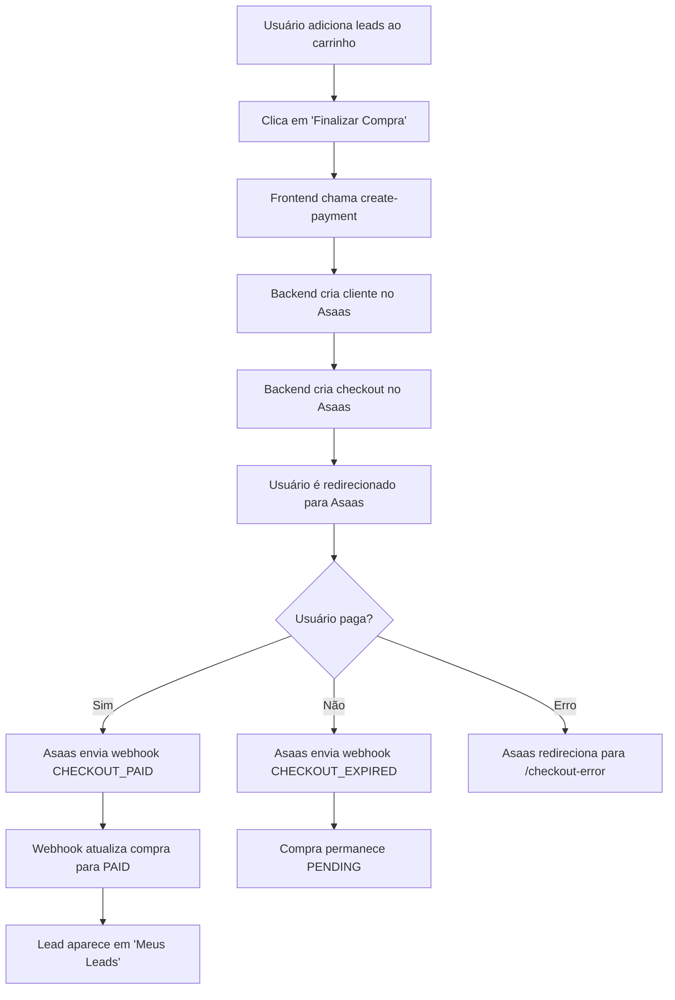

# 🔵 Guia Completo de Integração com Asaas Checkout (SANDBOX)

## 📋 Visão Geral

Esta é uma integração **100% funcional** com o Checkout do Asaas no ambiente **SANDBOX**, seguindo todas as melhores práticas e especificações da API.

---

## 🎯 Funcionalidades Implementadas

✅ **Criação de Cliente** - API POST /customers  
✅ **Criação de Checkout** - API POST /checkouts  
✅ **Redirecionamento Automático** - Para página de pagamento do Asaas  
✅ **Callbacks Configuradas** - Success, Error, Expired  
✅ **Webhook Completo** - Processa todos os eventos  
✅ **Integração com Database** - Salva compras e atualiza status  
✅ **Carrinho de Compras** - Sistema completo  

---

## 🔧 Configuração do Ambiente SANDBOX

### 1. Criar Conta Sandbox

Acesse: https://sandbox.asaas.com/  
Crie sua conta de teste (gratuita)

### 2. Obter Chave de API

1. Faça login no painel Sandbox
2. Vá em **Integrações → Chave da API**
3. Gere sua chave de SANDBOX
4. Configure no sistema como `ASAAS_API_KEY`

### 3. URL Base (já configurada)

```
https://api-sandbox.asaas.com/v3
```

⚠️ **IMPORTANTE**: Sempre use a URL do SANDBOX, nunca de produção!

---

## 🏗️ Estrutura da Integração

### Backend - Edge Functions

#### 1. `create-payment` (Criar Checkout)

**Endpoint**: `https://seu-projeto.supabase.co/functions/v1/create-payment`

**Headers Obrigatórios**:
```json
{
  "Authorization": "Bearer SEU_JWT_TOKEN",
  "Content-Type": "application/json"
}
```

**Body**:
```json
{
  "cartItems": [
    {
      "lead_id": "uuid-do-lead",
      "price": 100.00
    }
  ]
}
```

**Resposta**:
```json
{
  "success": true,
  "checkoutUrl": "https://sandbox.asaas.com/c/...",
  "checkoutId": "pay_..."
}
```

**O que faz**:
1. Autentica o usuário via JWT
2. Busca perfil do usuário
3. Cria/recupera cliente no Asaas
4. Cria checkout com todos os itens
5. Salva registros de compra (status: PENDING)
6. Retorna URL do checkout para redirecionamento

---

#### 2. `asaas-webhook` (Receber Eventos)

**Endpoint**: `https://seu-projeto.supabase.co/functions/v1/asaas-webhook`

**Método**: POST (público, sem JWT)

**Eventos Processados**:
- ✅ `CHECKOUT_CREATED` - Checkout criado
- ✅ `CHECKOUT_PAID` - Pagamento confirmado
- ✅ `CHECKOUT_CONFIRMED` - Pagamento confirmado
- ✅ `CHECKOUT_EXPIRED` - Checkout expirado
- ✅ `PAYMENT_RECEIVED` - Pagamento recebido
- ✅ `PAYMENT_CONFIRMED` - Pagamento confirmado
- ✅ `PAYMENT_OVERDUE` - Pagamento atrasado

**O que faz ao confirmar pagamento**:
1. Valida evento (evita duplicação)
2. Busca compras relacionadas
3. Atualiza status para PAID
4. Incrementa contador de compras do lead
5. Desativa lead se atingir limite
6. Limpa carrinho do usuário
7. Marca evento como processado

---

## 🔄 Fluxo Completo de Compra



---

## 📦 Estrutura do Checkout (JSON)

O payload enviado ao Asaas segue **EXATAMENTE** esta estrutura:

```json
{
  "billingTypes": ["PIX", "CREDIT_CARD"],
  "chargeTypes": ["ONETIME"],
  "items": [
    {
      "name": "Lead - uuid-123",
      "value": 150.00,
      "description": "Compra de lead ID: uuid-123"
    }
  ],
  "expiresIn": 60,
  "callback": {
    "successUrl": "https://hmcpfedcvkurttyolurv.lovable.app/checkout-success",
    "errorUrl": "https://hmcpfedcvkurttyolurv.lovable.app/checkout-error",
    "expiredUrl": "https://hmcpfedcvkurttyolurv.lovable.app/checkout-expired"
  },
  "customerData": {
    "name": "Nome do Cliente",
    "cpfCnpj": "12345678900",
    "email": "cliente@email.com",
    "phone": "11999999999"
  }
}
```

⚠️ **Regra Importante**: 
- Se usar `customerData`, NÃO envie `customer`
- Se usar `customer`, NÃO envie `customerData`

---

## 🧪 Como Testar no Sandbox

### 1. Testar Criação de Checkout

```bash
# Via frontend, adicione leads ao carrinho e finalize compra
# O sistema vai redirecionar automaticamente para Asaas
```

### 2. Testar Pagamentos

No **Sandbox do Asaas**:
- Pagamentos são fictícios
- Você pode "confirmar" manualmente
- Não use dados reais de cartão

**Para PIX**:
- QR Code é gerado mas não cobra de verdade
- Confirme manualmente no painel Asaas

**Para Cartão**:
- Use dados de teste
- Confirme manualmente no painel Asaas

### 3. Testar Webhooks

Configure no Asaas:
1. Vá em **Integrações → Webhooks**
2. Adicione URL: `https://seu-projeto.supabase.co/functions/v1/asaas-webhook`
3. Selecione eventos: CHECKOUT_*, PAYMENT_*
4. Salve

Quando testar pagamentos, os webhooks serão enviados automaticamente.

---

## 📊 Monitoramento

### Ver Logs das Edge Functions

```bash
# No Lovable, veja os logs em tempo real
# Todos os eventos são logados com detalhes
```

### Tabela de Eventos (asaas_webhook_events)

Todos os webhooks são salvos aqui para auditoria:
- `event_type` - Tipo do evento
- `asaas_event_id` - ID único do Asaas
- `payment_id` - ID do pagamento/checkout
- `processed` - Se foi processado
- `payload` - JSON completo do webhook

---

## ✅ Checklist de Testes

- [ ] Adicionar lead ao carrinho
- [ ] Remover lead do carrinho
- [ ] Finalizar compra
- [ ] Ser redirecionado para Asaas
- [ ] Ver página de pagamento
- [ ] Confirmar pagamento no Sandbox
- [ ] Ser redirecionado de volta
- [ ] Ver lead em "Meus Leads"
- [ ] Verificar contador de compras do lead
- [ ] Testar expiração de checkout

---

## 🔒 Segurança

✅ **Token NUNCA exposto no frontend**  
✅ **Todas as requisições via backend**  
✅ **Webhook público mas validado**  
✅ **Dados sensíveis em variáveis de ambiente**  
✅ **HTTPS obrigatório**  
✅ **Validação de duplicação de eventos**  

---

## 📝 Headers Utilizados

```typescript
{
  'access_token': 'SUA_CHAVE_SANDBOX',
  'Content-Type': 'application/json',
  'User-Agent': 'LeadMarket-System'
}
```

---

## 🚀 Próximos Passos

1. **Testar Integração Completa**
2. **Configurar Webhooks no Asaas**
3. **Validar Fluxos de Pagamento**
4. **Testar Casos de Erro**
5. **Preparar para Produção**

---

## ⚠️ Importante Antes de Produção

Quando for para produção:

1. Trocar URL base:
   - ❌ `https://api-sandbox.asaas.com/v3`
   - ✅ `https://api.asaas.com/v3`

2. Trocar chave de API:
   - ❌ Chave de Sandbox
   - ✅ Chave de Produção

3. Testar TUDO novamente

---

## 📞 Suporte

- Documentação Asaas: https://docs.asaas.com
- Sandbox Asaas: https://sandbox.asaas.com

---

**Desenvolvido com ❤️ seguindo todas as especificações da API Asaas**
